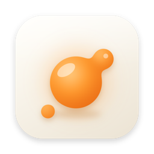
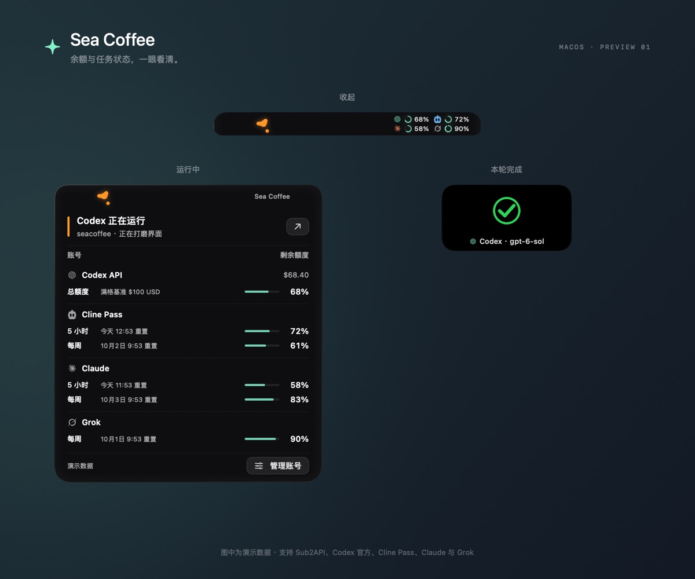

# Sea Coffee

English | [简体中文](README.md)

An AI status island that lives in your MacBook's notch. See at a glance whether Codex, Claude Code, Grok, Cline, and Pi are working, and how much of each subscription or balance you have left.

Native SwiftUI + AppKit. No Electron, no third-party runtime dependencies.



> The interface is currently in Simplified Chinese. The screenshot above uses demo data.

## Features

- **Task status**: follows the local session files of Codex, Claude Code, Grok, Cline, and Pi (including PI-Desktop, which keeps its sessions in SQLite) and shows how many conversations are running. When a task finishes, the notch plays a checkmark animation labelled with the agent and model that finished it (for example `Claude Code · claude-opus-5-5`). Failures and interruptions show a text notice.
- **Quotas and balances**, each refreshed independently:

  | Source | What it shows | How it connects |
  |---|---|---|
  | Codex API (Sub2API relay) | Wallet balance, key limit, subscription windows | Site URL + API key |
  | Codex official | 5-hour / weekly limits | Browser sign-in through `codex app-server` |
  | Cline Pass | 5-hour / weekly / monthly | API key, or device-code sign-in |
  | Claude | 5-hour / weekly / Sonnet and Opus weekly | Reuses your Claude Code login |
  | Grok | SuperGrok current period | Reuses your `grok login` session |

- **Privacy first**: only event types, timestamps, project folder names, and model names are read. Conversation content is never stored or uploaded. Logins borrowed from other tools are read-only.
- Quota indicators (small rings when collapsed, bars when expanded): green at 50% or more, yellow at 20–49%, red below 20%, grey when unknown. Unknown data is never shown as 0% or 100%.
- Respects the system "Reduce motion" setting. On Macs without a notch it appears as a pill at the top of the screen.

## Install

Requires macOS 14+ and the Swift 6 toolchain (Xcode Command Line Tools are enough).

```bash
git clone https://github.com/hbw00111/seacoffee.git
cd seacoffee
bash scripts/build-app.sh
open "dist/Sea Coffee.app"
```

The app is built to `dist/Sea Coffee.app`; drag it to Applications if you like. It lives in the menu bar with no Dock icon. The sparkle icon in the menu bar opens Settings, previews the animation, and quits.

> The app is not notarized by Apple. If macOS says it cannot verify the developer, right-click the app in Finder and choose Open.

## Usage

Open **Settings** and connect the sources you use:

- **Codex API**: enter your Sub2API site URL, API key, and the balance that counts as full, then click "保存并刷新" (Save and refresh). Only `GET /v1/usage` is called; no model requests are sent. After each top-up, the baseline moves to the new balance automatically.
- **Codex official**: switch the connection mode and click "连接官方账号" (Connect official account). A separate Codex home directory is used, so your existing Codex login is untouched.
- **Cline Pass**: create an API key at [app.cline.bot](https://app.cline.bot) and paste it in, or sign in with a device code in your browser.
- **Claude**: sign in with `claude` in a terminal first, then click "连接 Claude Code" (Connect Claude Code).
- **Grok**: run `grok login` first, then click "连接 Grok" (Connect Grok). After that, an expired token is refreshed by the Grok CLI automatically.
- **Task status**: all five agents are followed by default; each can be turned off. When Pi uses Cline Pass, the completion label names the channel and the usage counts toward the Cline quota.

To start Sea Coffee when you log in, turn on "开机自启" (Launch at login) under "外观与交互" (Appearance and interaction) in Settings; it takes effect immediately.

Hover over the top of the screen to expand; move away to collapse. "固定展开" (Keep expanded) in the menu bar keeps it open, and "预览动画" (Preview animation) shows the effects without touching real data.

## Security and privacy

- Credentials that Sea Coffee saves itself (Sub2API key, Cline login or key) live in `~/Library/Application Support/SeaIsland/credentials.json` with `0600` permissions and atomic writes. A file is used instead of the Keychain because, without an Apple Developer ID signature, Keychain grants are tied to each build's binary hash and are lost on every rebuild.
- Claude and Grok tokens are read-only, kept in memory, and never refreshed or written back, so the original tools stay signed in.
- No request follows redirects, and credentials are never written to logs or UserDefaults.
- The Claude, Grok, and Cline quota endpoints are the ones their websites or CLIs use, not stable public APIs. If a format changes, Sea Coffee keeps the last value and shows a notice rather than a wrong number.

Data sources, protocols, and implementation details are documented (in Chinese) in [docs/how-it-works.md](docs/how-it-works.md); current status, roadmap, and known issues are in [docs/progress.md](docs/progress.md).

## Development

```bash
swift run IslandChecks                   # core checks: parsers, state machines, credential file
bash scripts/check-account-isolation.sh  # sources never overwrite each other's quota or status
bash scripts/check-credentials.sh        # credential store and legacy Keychain import (isolated test item)
```

- `Sources/IslandCore`: UI-independent logic, including quota parsers, session state machines, and the credential file.
- `Sources/SeaCoffee`: interface, overlay panel, networking, and account integrations.
- The checks do not need full Xcode and never touch the network or your real credentials.

Issues and pull requests are welcome; see [CONTRIBUTING.md](CONTRIBUTING.md).

## Acknowledgements

- [CodexBar](https://github.com/steipete/CodexBar) (MIT): research into provider quota endpoints, and the embedded provider icons (`ProviderIcon-*.svg`).
- [NotchAI](https://github.com/Winnie-Wong2026/NotchAI): ideas for the AppKit overlay and local monitoring.
- [Sub2API](https://github.com/Wei-Shaw/sub2api), [Codex App Server](https://developers.openai.com/codex/app-server), [Cline SDK](https://github.com/cline/cline): API fields and sign-in protocols.

Codex, Claude, Cline, and Grok names and logos belong to OpenAI, Anthropic, Cline, and xAI. This project is not affiliated with any of them; the logos only identify each quota source.

## License

[MIT](LICENSE)
